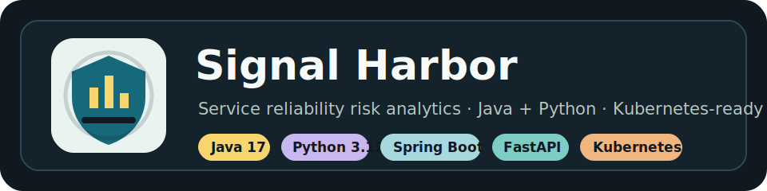
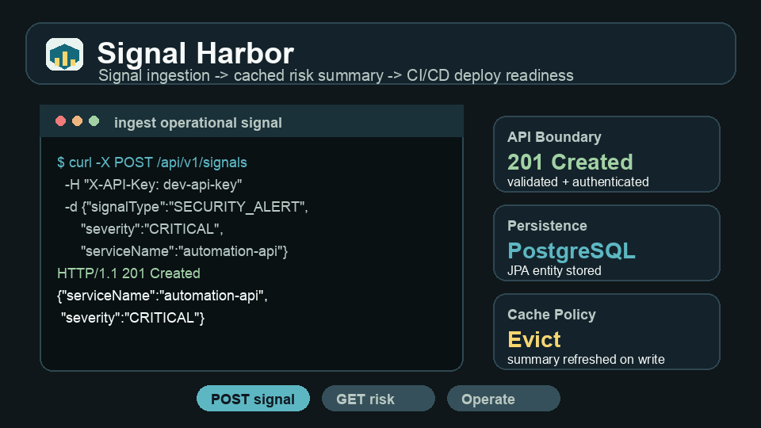
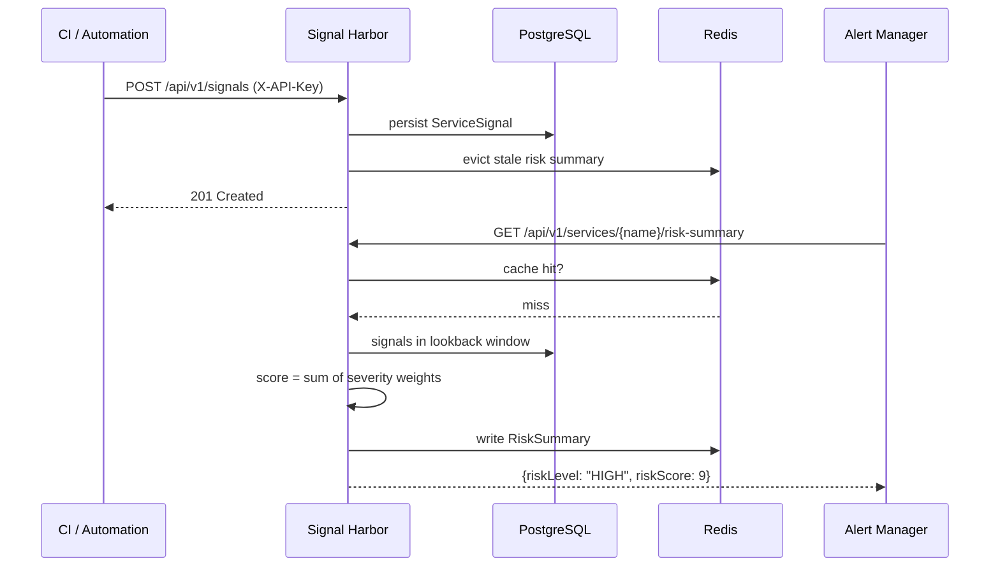
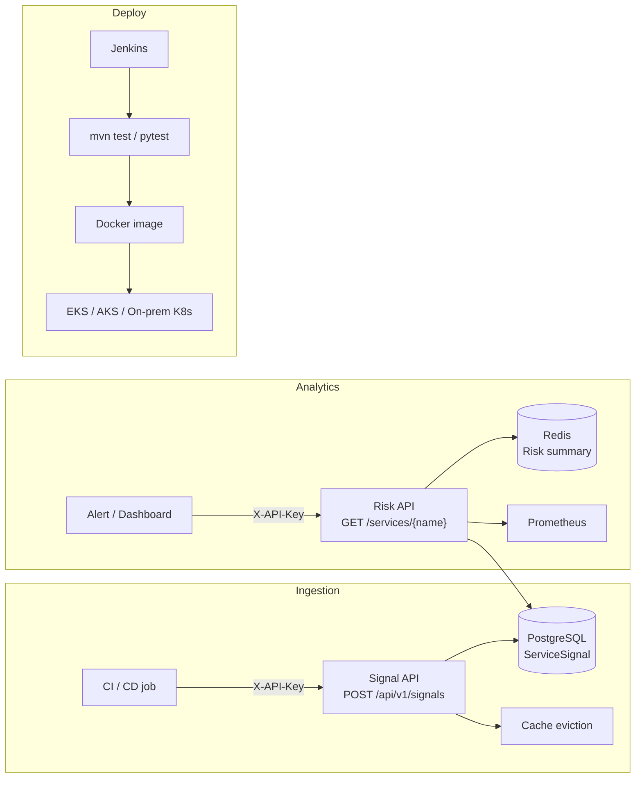

<p align="center">
  
</p>

<p align="center">
  <a href="https://github.com/gerardrecinto/signal-harbor/actions/workflows/ci.yml"></a>
  
  
  
  
  
  
  
</p>

Signal Harbor is a reliability intelligence service for engineering teams that want one lightweight place to collect deployment, build, security, and runtime signals. It turns noisy operational events into a per-service risk score so platform teams, SREs, and delivery leads can see which services need attention before an incident gets expensive.

It is built as a product-shaped reference implementation: authenticated APIs, deterministic scoring, PostgreSQL persistence, Redis caching, metrics, Docker, Jenkins, Kubernetes deployment wiring, and Terraform examples for AWS, Azure, GCP, and on-prem environments.

## Commercial Use Cases

| Use case | What Signal Harbor provides |
|---|---|
| Release readiness dashboard | Roll deployment failures, build failures, latency spikes, and security alerts into one service-level risk score |
| Client platform assessment | Demonstrate how CI/CD, observability, caching, and Kubernetes delivery can be connected in a compact backend |
| Internal developer portal backend | Feed risk summaries into Backstage, Slack bots, dashboards, or release gates |
| Managed DevOps/SRE offering | Give clients a visible, explainable health signal without asking them to replace their monitoring stack |

## Demo



A signal is ingested, persisted, and immediately factored into the cached risk summary. The risk level climbs from `LOW` to `ELEVATED` to `HIGH` as signals accumulate, then drops when signals age out of the lookback window.

## How It Works



## Architecture



## Signal Types and Risk Scoring

| Signal type | Typical source |
|---|---|
| `BUILD_FAILURE` | Jenkins, GitHub Actions |
| `DEPLOYMENT_FAILURE` | Helm, ArgoCD, deploy script |
| `LATENCY_SPIKE` | Prometheus alertmanager |
| `ERROR_RATE_SPIKE` | Grafana alert |
| `SECURITY_ALERT` | Trivy, Falco, SIEM |
| `DATABASE_SATURATION` | RDS CloudWatch, pg_stat |

| Severity | Weight | When to use |
|---|---|---|
| `INFO` | 1 | Slow build, minor latency blip |
| `WARNING` | 3 | Elevated error rate, memory pressure |
| `CRITICAL` | 5 | Deployment failure, 5xx spike |

| Risk level | Score |
|---|---|
| `LOW` | below 4 |
| `ELEVATED` | 4 to 8 |
| `HIGH` | 9 to 14 |
| `SEVERE` | 15 and above |

Scores aggregate all signals inside a configurable lookback window (default 24 hours). One `CRITICAL` deployment failure plus one `WARNING` latency spike equals score 8, so `ELEVATED`. Scores drop automatically as signals age out.

## Quick Start

```bash
git clone https://github.com/gerardrecinto/signal-harbor.git
cd signal-harbor
cp .env.example .env
docker compose up -d
```

Java / Spring Boot:
```bash
./mvnw spring-boot:run
```

Python / FastAPI:
```bash
cd python
pip install -e ".[dev]"
uvicorn signal_harbor.main:app --reload
```

The Java, FastAPI, and Django implementations use the same API shape so teams can compare framework tradeoffs without changing the product contract.

## API

### Ingest a signal

```bash
curl -X POST http://localhost:8080/api/v1/signals \
  -H "Content-Type: application/json" \
  -H "X-API-Key: dev-api-key" \
  -d '{
    "serviceName": "payments-api",
    "environment": "prod",
    "signalType": "DEPLOYMENT_FAILURE",
    "severity": "CRITICAL",
    "observedAt": "2026-05-31T12:00:00Z",
    "summary": "Helm rollout failed on 3 of 5 pods"
  }'
```

Response 201:
```json
{
  "id": "a1b2c3d4-...",
  "serviceName": "payments-api",
  "signalType": "DEPLOYMENT_FAILURE",
  "severity": "CRITICAL",
  "observedAt": "2026-05-31T12:00:00Z"
}
```

### Get risk summary

```bash
curl http://localhost:8080/api/v1/services/payments-api/risk-summary \
  -H "X-API-Key: dev-api-key"
```

Response 200:
```json
{
  "serviceName": "payments-api",
  "windowStart": "2026-05-30T12:00:00Z",
  "windowEnd": "2026-05-31T12:00:00Z",
  "signalCount": 3,
  "riskScore": 11,
  "riskLevel": "HIGH",
  "signalsByType": {
    "DEPLOYMENT_FAILURE": 1,
    "ERROR_RATE_SPIKE": 2
  }
}
```

### Health and metrics

```bash
curl http://localhost:8080/actuator/health
curl http://localhost:8080/actuator/prometheus
curl http://localhost:8080/health        # Python
```

## Multi-Framework Architecture

The Python implementation in `python/` uses hexagonal architecture so each layer has a single job and services depend on interfaces rather than concrete databases or cache clients. Swapping PostgreSQL for another store means writing one new adapter, without changing the product API.

```
python/signal_harbor/
├── domain/         pure scoring logic, no framework code
│   ├── enums.py    SignalType, Severity with .weight, RiskLevel
│   └── risk_policy.py   RiskPolicy base class + WeightedRiskPolicy
├── ports/          protocols the services code against
│   ├── signal_reader.py
│   ├── signal_writer.py
│   └── cache.py
├── adapters/       PostgreSQL and Redis implementations of those protocols
├── services/       ingestion and risk scoring wired to ports
└── api/            FastAPI router, Pydantic schemas, API key auth
```

Tests use a dict-based `FakeCache` and SQLite so core behavior can run quickly without external services.

## Deployment

### Jenkins Pipeline

The [Jenkinsfile](Jenkinsfile) keeps tests, packaging, image creation, and credential injection in separate stages:

1. Tests run before any image build.
2. Runtime secrets come from Jenkins credentials, not the image.
3. `docker build` only packages the prebuilt artifact.
4. Optional stages wire in AWS EKS, Azure AKS, or on-prem Kubernetes credentials.

| Credential ID | Type | Purpose |
|---|---|---|
| `signal-harbor-api-key` | Secret text | Runtime API key |
| `signal-harbor-postgres` | Username/password | PostgreSQL credentials |
| `aws-deploy` + `aws-eks-kubeconfig` | AWS + Secret file | EKS deploy |
| `azure-service-principal` + `azure-aks-kubeconfig` | Azure SP + Secret file | AKS deploy |
| `onprem-ssh-key` + `onprem-kubeconfig` | SSH + Secret file | On-prem K8s |

### Container and Ingress

The Docker image runs on port 80. An ingress controller terminates TLS on 443 and routes plain HTTP to the service on 80, so no TLS config lives inside the application.

## Configuration

| Variable | Default | Description |
|---|---|---|
| `SIGNAL_HARBOR_API_KEY` | required | Auth key for `X-API-Key` header |
| `SIGNAL_HARBOR_RISK_LOOKBACK_HOURS` | `24` | Signal window for scoring |
| `SPRING_DATASOURCE_URL` | required | PostgreSQL JDBC URL |
| `SPRING_REDIS_HOST` | `localhost` | Redis host |
| `DATABASE_URL` | required | PostgreSQL URL (Python) |
| `REDIS_URL` | `redis://localhost:6379` | Redis URL (Python) |

## Tech Stack

| Layer | Java | Python |
|---|---|---|
| Framework | Spring Boot 3.3 | FastAPI 0.111 |
| ORM | Spring Data JPA | SQLAlchemy 2.0 |
| Cache | Spring Cache / Redis | redis-py |
| Auth | Spring Security filter | FastAPI dependency |
| Metrics | Micrometer + Prometheus | prometheus-client |
| Tests | JUnit 5, MockMvc, H2 | pytest, httpx, SQLite |
| Deploy | Docker, Jenkins, K8s | Docker, Jenkins, K8s |

## Repo Map

| Path | Purpose |
|---|---|
| `src/main/java/.../api` | REST boundary, request/response, validation |
| `src/main/java/.../signal` | Signal entity, repository, ingestion service |
| `src/main/java/.../analytics` | Risk scoring policy and summary model |
| `src/main/java/.../security` | API key filter |
| `python/signal_harbor/domain` | Pure domain logic, no framework dependency |
| `python/signal_harbor/ports` | Protocols for storage and cache |
| `python/signal_harbor/adapters` | PostgreSQL and Redis implementations |
| `python/signal_harbor/services` | Business logic wired to ports |
| `python/signal_harbor/api` | FastAPI router, Pydantic schemas, auth |
| `docs/ARCHITECTURE.md` | Design rationale and tradeoff notes |
| `Jenkinsfile` | CI/CD pipeline with separated test, build, and deploy stages |
| `docker-compose.yml` | Local stack with app, PostgreSQL, and Redis |
