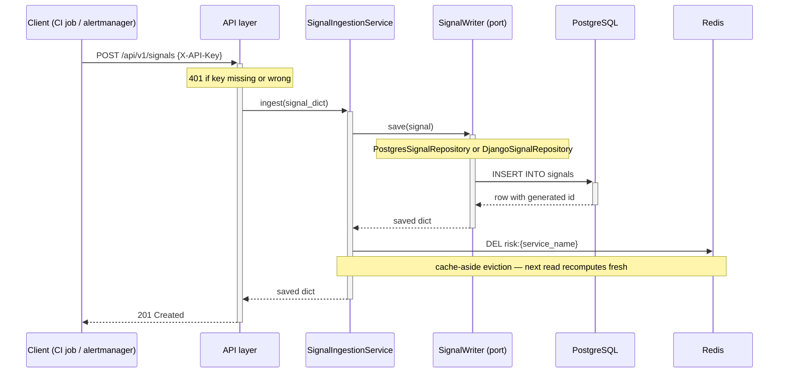
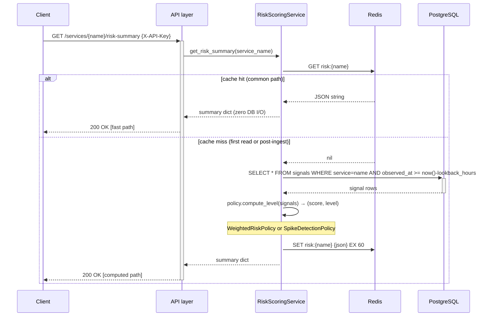
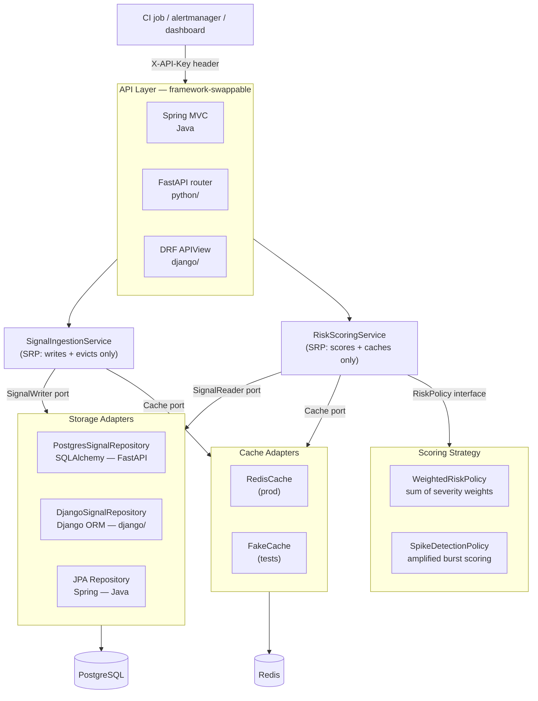

# Architecture

## Layer Map

```
┌──────────────────────────────────────────────────────────────────┐
│  API  ·  Spring MVC  ·  FastAPI router  ·  Django REST Framework │
├──────────────────────────────────────────────────────────────────┤
│  Services  ·  SignalIngestionService  ·  RiskScoringService      │
├──────────────────────────────────────────────────────────────────┤
│  Ports  ·  SignalWriter  ·  SignalReader  ·  Cache  (Protocols)  │
├──────────────────────────────────────────────────────────────────┤
│  Adapters  ·  PostgresSignalRepository  ·  DjangoSignalRepository│
│            ·  RedisCache  ·  FakeCache (tests)                   │
└──────────────────────────────────────────────────────────────────┘
           domain and ports are framework-zero — zero imports above them
```

> **Engineering note:** This is Hexagonal Architecture (Ports and Adapters). The rule: inner layers never import outer layers. The domain has no `import fastapi`, no `import django`, no `import sqlalchemy`. Swap the database by writing one new adapter class — nothing else changes.

---

## Write Path — POST /api/v1/signals



> **Engineering note — cache-aside:** Evict-on-write guarantees consistency. The alternative (write-through) requires atomic DB+cache writes. Cache-aside is simpler and correct here because the miss cost (one SQL window query) is acceptable. Failure mode if Redis is down: every read falls back to a full DB scan — degraded latency, not an outage.

---

## Read Path — GET /api/v1/services/{name}/risk-summary



> **Engineering note — read path:** "Stateless" means the service holds no mutable state — it reads all needed data from the DB window query every miss. This makes horizontal scaling trivial. Multiple pods all share the same Redis cache, so cache warm-up is collective, not per-pod.

---

## Component Map



---

## Design Decisions

**Ingestion and scoring are separate services.** Signal writes and risk reads have different access patterns. Keeping them apart means each can scale, cache, and evolve independently.

> **Engineering note:** SRP at the service level. For write spikes, ingestion scales horizontally while the risk read path is unaffected. Cache-hit reads are Redis-only and don't touch the write path at all.

**Risk summaries are cached and evicted on write.** Scoring requires a full window query. Caching per service name keeps read latency low without serving stale data.

> **Engineering note:** For thundering-herd risk on cache miss, per-service keys mean a miss for `checkout` doesn't affect `payments`. Under extreme load, add a distributed lock (Redlock) around the miss computation to prevent duplicate window queries.

**Scoring policy is deterministic and stateless.** Score = sum of severity weights over a time window. No ML, no probabilistic logic — the output is fully auditable.

> **Engineering note:** Strategy pattern (OCP). Swapping `WeightedRiskPolicy` for `SpikeDetectionPolicy` requires changing exactly one line in the composition root (`main.py` or `apps.py`). The services and tests are unchanged.

**API key auth over OAuth.** A stateless header filter is enough for machine-to-machine callers (CI pipelines, alertmanager webhooks).

> **Engineering note:** Right-size the auth mechanism. OAuth adds complexity (token refresh, JWKS endpoints) that isn't needed for M2M. Upgrading is a new middleware — services and domain are untouched. This is DIP applied to auth.

**Tests run without Docker.** Spring uses H2. Python uses SQLite + `FakeCache`. Django uses SQLite + `FakeCache`.

> **Engineering note:** Ports make this possible. Tests inject `FakeCache` (a dict) and an in-memory DB that satisfy the same Protocol/interface. No mocks of internal classes — only fake infrastructure at the boundary. This is how you get fast, reliable tests without `docker compose up`.

**Port 80 in the image, TLS at the ingress.** Ingress terminates TLS on 443 and routes plain HTTP to the service on 80.

> **Engineering note:** Standard K8s ingress pattern. The application image stays certificate-free — certificate rotation is an infra concern, not a deploy.

---

## Python Hexagonal Architecture — FastAPI vs Django

Both Python ports share `domain/`, `ports/`, and `services/` unchanged. Only the adapter layer differs.

```
Shared across FastAPI and Django:
  domain/      zero-dependency scoring rules and enums
  ports/       Protocol definitions — the contracts services depend on
  services/    SignalIngestionService + RiskScoringService

FastAPI only (python/):
  adapters/    SQLAlchemy PostgresSignalRepository + RedisCache
  api/         FastAPI router, Pydantic schemas, Depends-based auth

Django only (django/):
  signals/     Django ORM DjangoSignalRepository + DRF APIViews
               + ApiKeyMiddleware + AppConfig composition root
```

> **Engineering note:** This is the strongest portability proof in the architecture. Two completely different web frameworks wire to the exact same service logic because services depend on `ports.SignalWriter`, not on `SQLAlchemy` or `Django ORM`. This is the clearest extension point for framework portability.
