# Design Patterns And OOP Reference

Signal Harbor is intentionally structured as a small but realistic reliability product. This document maps the codebase to practical object-oriented programming concepts and design patterns across the Java Spring Boot service, the FastAPI service, and the Django service.

The goal is not to force every pattern into the code. The goal is to show where each pattern genuinely fits, what problem it solves, and where the next product extension would naturally use it.

## Quick Map

| Concept or pattern | Status | Where to look |
|---|---|---|
| Encapsulation | Implemented | `ServiceSignal`, `Alert`, service classes |
| Abstraction | Implemented | Java interfaces, Python `Protocol`, abstract risk policy |
| Inheritance | Implemented | `OncePerRequestFilter`, Django `APIView`, SQLAlchemy `DeclarativeBase`, Python `ABC` |
| Polymorphism | Implemented | risk strategies, cache/storage ports, observers |
| Composition | Implemented | services composed from repositories, cache, policy, settings |
| SOLID | Implemented | services, ports, adapters, strategies |
| Strategy | Implemented | risk scoring algorithms |
| Observer | Implemented | signal event publisher and remediation observer |
| Builder | Implemented | Java `Alert.Builder`, Python `SignalBuilder` |
| Singleton | Implemented | demonstration connection pool |
| Adapter | Implemented | Postgres, Redis, Django ORM, Spring Data adapters |
| Facade | Implemented | service layer hides repository/cache/policy details from controllers |
| Repository | Implemented | Spring Data `ServiceSignalRepository`, SQLAlchemy repository, Django ORM adapter |
| Dependency Injection | Implemented | Spring constructor injection, FastAPI/Django composition roots |
| Template Method | Framework-level | Spring filter chain, Django `APIView`, SQLAlchemy base hooks |
| Proxy | Framework-level | Spring Cache, Spring Data repositories, Django ORM querysets |
| Decorator | Framework-level | Spring annotations, FastAPI route decorators, Django middleware |
| Factory Method | Framework-level | `create_app()`, `build_session_factory()`, Spring bean creation |
| Command | Natural extension | remediation jobs, release gates, async deploy actions |
| Chain of Responsibility | Natural extension | validation/auth/risk enrichment pipeline |
| State | Natural extension | incident lifecycle or release gate lifecycle |
| Composite | Natural extension | roll service risk up to team/domain/org risk |
| Specification | Natural extension | reusable signal filters and release policies |
| Unit of Work | Natural extension | transactional ingestion with multiple writes |

## OOP Foundations In The Codebase

### Encapsulation

Encapsulation keeps data and behavior behind a stable boundary.

| Example | What is encapsulated |
|---|---|
| `ServiceSignal` | persisted signal fields and JPA mapping details |
| `Alert` | alert construction details, defaults, optional fields |
| `RiskScoringService` | lookback-window query, scoring, metrics, summary assembly |
| `SignalIngestionService` | persistence, cache eviction, event publication |
| `PostgresSignalRepository` | SQLAlchemy sessions and SQL row mapping |
| `RedisCache` | Redis client commands and TTL handling |

Why it matters: controllers do not need to know how a signal is stored, how Redis keys are formed, or how a risk score is calculated. Those concerns stay inside focused classes.

### Abstraction

Abstraction exposes what callers need and hides implementation details.

Java:

- `RiskScoringStrategy` exposes `computeScore()` and `toLevel()`.
- `SignalObserver` exposes `onSignalIngested()`.
- `ServiceSignalRepository` exposes repository methods without exposing SQL.

Python:

- `SignalReader`, `SignalWriter`, and `Cache` are `Protocol` contracts.
- `RiskPolicy` is an abstract base class for scoring policies.

The important design move is that services depend on contracts, not concrete infrastructure. That lets tests use fakes and production use PostgreSQL/Redis.

### Inheritance

Inheritance appears where the framework or language model makes it useful.

| File | Inheritance example | Why it fits |
|---|---|---|
| `ApiKeyAuthenticationFilter.java` | extends `OncePerRequestFilter` | customize one step in Spring Security's filter lifecycle |
| `django/signals/views.py` | extends `APIView` | plug into Django REST Framework request handling |
| `python/signal_harbor/adapters/postgres.py` | `SignalOrm(Base)` | SQLAlchemy declarative mapping |
| `python/signal_harbor/domain/risk_policy.py` | concrete policies extend `RiskPolicy` | enforce a shared scoring contract |

Inheritance is used sparingly. Most app behavior is composed through interfaces/protocols because composition is easier to test and extend.

### Polymorphism

Polymorphism means the caller can use the same method through different concrete implementations.

| Caller | Contract | Concrete implementations |
|---|---|---|
| `RiskScoringService` | `RiskScoringStrategy` / `RiskPolicy` | weighted scoring, spike detection |
| `SignalIngestionService` | `SignalWriter` | SQLAlchemy repo, Django ORM adapter, Spring Data repository |
| `RiskScoringService` | `Cache` | Redis cache, fake in-memory cache |
| `SignalEventPublisher` | `SignalObserver` | remediation observer, future Slack/PagerDuty/webhook observers |

The service does not need an `if redis then... else fake...` branch. It calls the contract and polymorphism routes the call to the right implementation.

### Composition

Composition is the main design style in Signal Harbor.

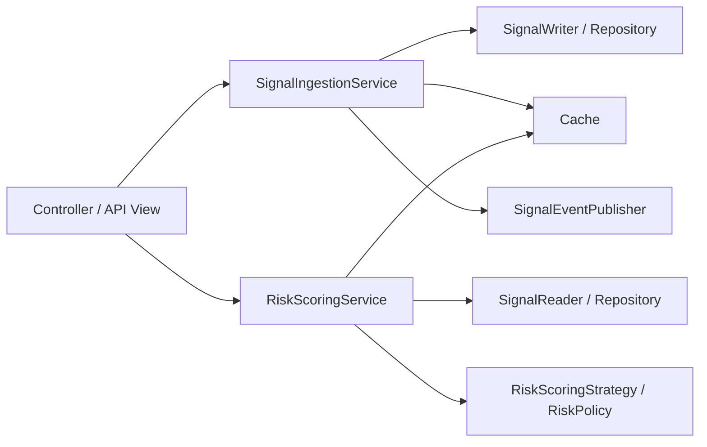
```mermaid
flowchart LR
    Controller["Controller / API View"] --> Ingest["SignalIngestionService"]
    Controller --> Risk["RiskScoringService"]
    Ingest --> Writer["SignalWriter / Repository"]
    Ingest --> Cache["Cache"]
    Ingest --> Publisher["SignalEventPublisher"]
    Risk --> Reader["SignalReader / Repository"]
    Risk --> Cache
    Risk --> Policy["RiskScoringStrategy / RiskPolicy"]
```

Each object receives collaborators instead of constructing everything internally. That makes the system modular and testable.

## SOLID Principles

### Single Responsibility Principle

Each class has one main reason to change.

| Class | Responsibility |
|---|---|
| `SignalController` | HTTP endpoint boundary |
| `SignalIngestionService` | ingest signal, persist it, evict cache, publish event |
| `RiskScoringService` | read recent signals and return a risk summary |
| `WeightedRiskScoringStrategy` | compute weighted score |
| `RemediationTriggerObserver` | react to ingested critical signals |
| `RedisCache` | store/get/delete cached values |

### Open/Closed Principle

The code is open for extension and closed for modification in several places.

- Add a new risk algorithm by implementing `RiskScoringStrategy` or `RiskPolicy`.
- Add a new observer by implementing `SignalObserver`.
- Add a new persistence backend by implementing the signal reader/writer contracts.
- Add a new cache implementation by satisfying the `Cache` protocol.

### Liskov Substitution Principle

Any implementation of a port should be usable without breaking callers.

- `FakeCache` can substitute for `RedisCache` in tests.
- `PostgresSignalRepository` can satisfy both `SignalReader` and `SignalWriter`.
- A future `DynamoSignalRepository` or `KafkaSignalWriter` can slot in if it obeys the same contract.

### Interface Segregation Principle

Interfaces stay small.

- `SignalReader` reads signals.
- `SignalWriter` writes signals.
- `Cache` only handles `get`, `set`, and `delete`.
- `SignalObserver` only reacts to one signal event.

A writer does not need to implement read methods, and a cache does not need to know domain scoring.

### Dependency Inversion Principle

High-level services depend on abstractions.

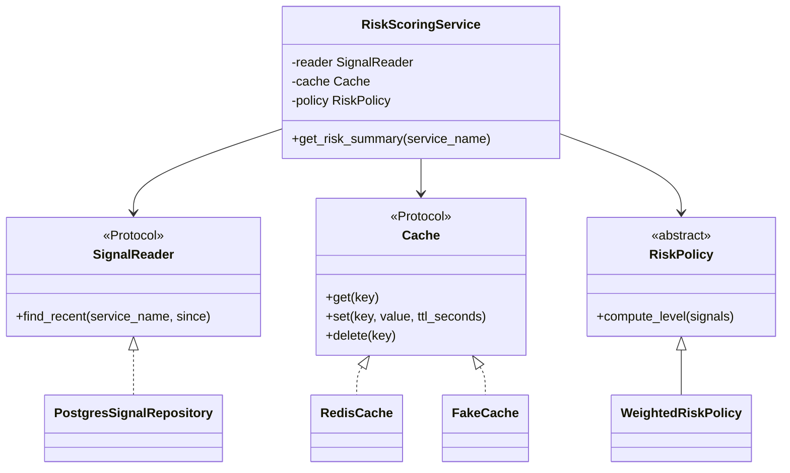
```mermaid
classDiagram
    class RiskScoringService {
        -reader SignalReader
        -cache Cache
        -policy RiskPolicy
        +get_risk_summary(service_name)
    }
    class SignalReader {
        <<Protocol>>
        +find_recent(service_name, since)
    }
    class Cache {
        <<Protocol>>
        +get(key)
        +set(key, value, ttl_seconds)
        +delete(key)
    }
    class RiskPolicy {
        <<abstract>>
        +compute_level(signals)
    }
    class PostgresSignalRepository
    class RedisCache
    class FakeCache
    class WeightedRiskPolicy

    RiskScoringService --> SignalReader
    RiskScoringService --> Cache
    RiskScoringService --> RiskPolicy
    SignalReader <|.. PostgresSignalRepository
    Cache <|.. RedisCache
    Cache <|.. FakeCache
    RiskPolicy <|-- WeightedRiskPolicy
```

This is why the tests can use SQLite and a dict cache while production uses PostgreSQL and Redis.

## Implemented Patterns

## 1. Strategy

Risk scoring is an algorithm family. The service should not care which scoring algorithm is active.

**Java:** [RiskScoringStrategy](../src/main/java/dev/gerard/signalharbor/analytics/RiskScoringStrategy.java), [WeightedRiskScoringStrategy](../src/main/java/dev/gerard/signalharbor/analytics/WeightedRiskScoringStrategy.java), [SpikeDetectionScoringStrategy](../src/main/java/dev/gerard/signalharbor/analytics/SpikeDetectionScoringStrategy.java)

**Python:** [risk_policy.py](../python/signal_harbor/domain/risk_policy.py), [django/domain/risk_policy.py](../django/domain/risk_policy.py)

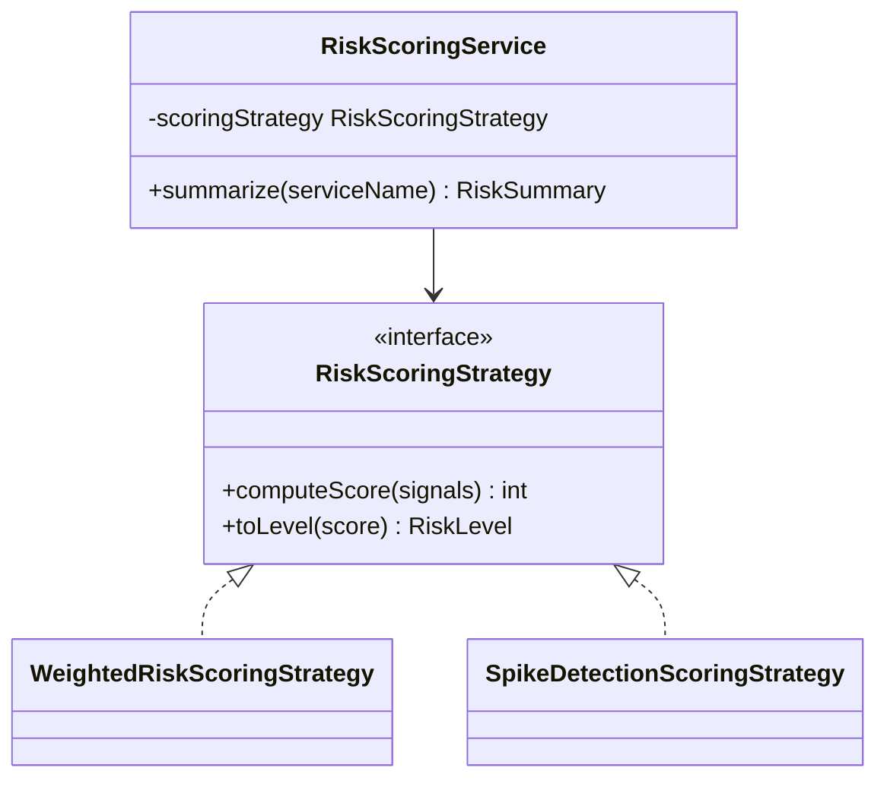
```mermaid
classDiagram
    class RiskScoringStrategy {
        <<interface>>
        +computeScore(signals) int
        +toLevel(score) RiskLevel
    }
    class WeightedRiskScoringStrategy
    class SpikeDetectionScoringStrategy
    class RiskScoringService {
        -scoringStrategy RiskScoringStrategy
        +summarize(serviceName) RiskSummary
    }
    RiskScoringStrategy <|.. WeightedRiskScoringStrategy
    RiskScoringStrategy <|.. SpikeDetectionScoringStrategy
    RiskScoringService --> RiskScoringStrategy
```

Why it fits:

- Weighted scoring is simple and auditable.
- Spike detection can amplify bursty behavior without rewriting the service.
- A future ML policy could be added behind the same interface.

Tradeoff:

- Strategy adds one more class/interface layer.
- That layer is worth it when the algorithm is likely to change.

## 2. Observer

Signal ingestion should trigger side effects without coupling ingestion to every downstream action.

**Java:** [SignalObserver](../src/main/java/dev/gerard/signalharbor/signal/SignalObserver.java), [SignalEventPublisher](../src/main/java/dev/gerard/signalharbor/signal/SignalEventPublisher.java), [RemediationTriggerObserver](../src/main/java/dev/gerard/signalharbor/remediation/RemediationTriggerObserver.java)

**Python:** [event_bus.py](../python/signal_harbor/domain/event_bus.py)

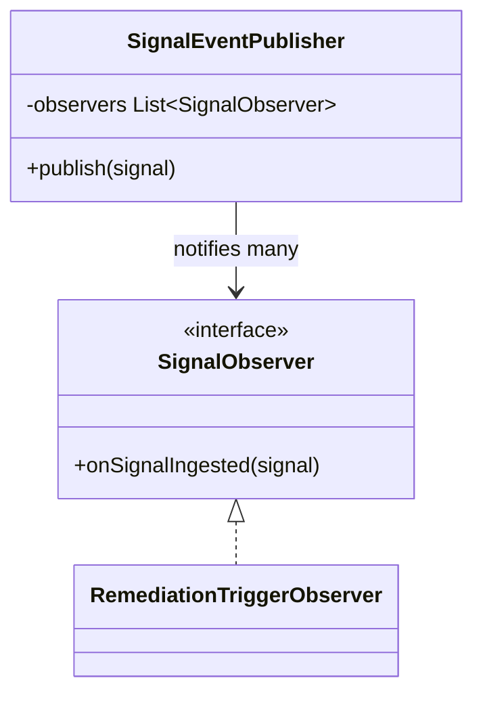
```mermaid
classDiagram
    class SignalObserver {
        <<interface>>
        +onSignalIngested(signal)
    }
    class SignalEventPublisher {
        -observers List~SignalObserver~
        +publish(signal)
    }
    class RemediationTriggerObserver
    SignalObserver <|.. RemediationTriggerObserver
    SignalEventPublisher --> SignalObserver : notifies many
```

Why it fits:

- Ingestion stays focused on writing signals.
- Remediation, Slack notifications, audit trails, and webhooks can be added as subscribers.
- Spring can auto-inject all `SignalObserver` beans.

Production hardening:

- Run slow observers asynchronously.
- Catch observer exceptions so one subscriber cannot break ingestion.
- Add dead-letter handling for failed side effects.

## 3. Builder

Some objects have required fields plus many optional fields. Builder makes construction readable.

**Java:** [Alert.java](../src/main/java/dev/gerard/signalharbor/remediation/Alert.java)

**Python:** [signal_builder.py](../python/signal_harbor/domain/signal_builder.py)

```mermaid
classDiagram
    class Alert {
        -serviceName String
        -riskLevel RiskLevel
        -triggeredAt Instant
        -runbook String
        -oncallTeam String
        -pagerDutyEnabled boolean
    }
    class Builder {
        +triggeredAt(Instant) Builder
        +runbook(String) Builder
        +oncallTeam(String) Builder
        +pagerDutyEnabled(boolean) Builder
        +build() Alert
    }
    Alert +-- Builder
```

Why it fits:

- Required fields are enforced up front.
- Optional fields are named at the call site.
- The final object can be immutable.

Example shape:

```java
Alert alert = new Alert.Builder("payments-api", RiskLevel.SEVERE)
        .runbook("https://runbooks/payments")
        .oncallTeam("payments-oncall")
        .pagerDutyEnabled(true)
        .build();
```

## 4. Singleton

The connection pool example demonstrates a controlled single instance.

**Java:** [DatabaseConnectionPool.java](../src/main/java/dev/gerard/signalharbor/config/DatabaseConnectionPool.java)

**Python:** [db_pool.py](../python/signal_harbor/adapters/db_pool.py)

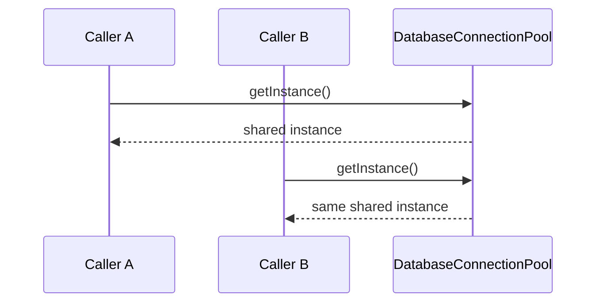
```mermaid
sequenceDiagram
    participant A as Caller A
    participant B as Caller B
    participant Pool as DatabaseConnectionPool
    A->>Pool: getInstance()
    Pool-->>A: shared instance
    B->>Pool: getInstance()
    Pool-->>B: same shared instance
```

Why it fits:

- A process should not accidentally create unlimited connection pools.
- The Java example uses double-checked locking with `volatile`.
- The Python example uses `__new__` with a class-level lock.

Production note:

- In Spring apps, prefer the container-managed singleton bean lifecycle for most services.
- Use raw Singleton carefully because it can hide global state and complicate tests.

## 5. Adapter

Adapters let the product use different infrastructure through the same app-facing contract.

| Adapter | Contract satisfied | Infrastructure hidden |
|---|---|---|
| `PostgresSignalRepository` | `SignalReader`, `SignalWriter` | SQLAlchemy sessions and rows |
| `DjangoSignalRepository` | `SignalReader`, `SignalWriter` | Django ORM queries |
| `RedisCache` | `Cache` | Redis command syntax and TTLs |
| `ServiceSignalRepository` | repository abstraction | Spring Data JPA query generation |

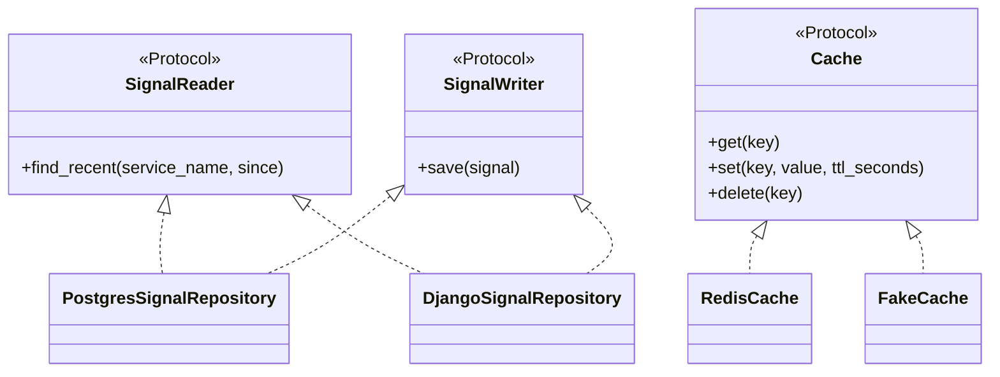
```mermaid
classDiagram
    class SignalReader {
        <<Protocol>>
        +find_recent(service_name, since)
    }
    class SignalWriter {
        <<Protocol>>
        +save(signal)
    }
    class Cache {
        <<Protocol>>
        +get(key)
        +set(key, value, ttl_seconds)
        +delete(key)
    }
    class PostgresSignalRepository
    class DjangoSignalRepository
    class RedisCache
    class FakeCache

    SignalReader <|.. PostgresSignalRepository
    SignalWriter <|.. PostgresSignalRepository
    SignalReader <|.. DjangoSignalRepository
    SignalWriter <|.. DjangoSignalRepository
    Cache <|.. RedisCache
    Cache <|.. FakeCache
```

Why it fits:

- Services do not know whether they are using SQLAlchemy, Django ORM, Redis, or an in-memory fake.
- Infrastructure details stay at the edge.

## 6. Repository

Repository hides persistence details behind collection-like methods.

**Java:** [ServiceSignalRepository.java](../src/main/java/dev/gerard/signalharbor/signal/ServiceSignalRepository.java)

**Python:** [postgres.py](../python/signal_harbor/adapters/postgres.py), [orm_adapter.py](../django/signals/orm_adapter.py)

Why it fits:

- Risk scoring needs recent signals by service and time window.
- Controllers and services should not build SQL strings.
- Tests can swap the repository implementation.

Repository is closely related to Adapter here: the repository is the storage adapter.

## 7. Facade

The service layer acts as a facade over several internal operations.

| Facade | Hides |
|---|---|
| `SignalIngestionService` | validation handoff, persistence, cache eviction, event publishing |
| `RiskScoringService` | window calculation, repository query, scoring policy, metrics, response assembly |

Why it fits:

- Controllers call one method.
- The workflow remains understandable even as internals grow.
- Product APIs stay stable while implementation evolves.

## 8. Dependency Injection

Dependency Injection is the wiring pattern used across the repo.

Java:

- Spring injects repositories, properties, observers, meter registry, and strategies.
- Constructor injection makes dependencies explicit.

Python:

- `create_app()` and Django `AppConfig.ready()` compose services from adapters.
- Tests replace concrete adapters with fakes.

Why it fits:

- Dependencies are visible.
- Tests can isolate behavior.
- Runtime environments can use different adapters.

## 9. Factory Method

Factory methods centralize object creation when construction has environment-specific details.

| Factory-like function | Purpose |
|---|---|
| `create_app()` | builds a FastAPI app with routes and lifespan wiring |
| `build_session_factory()` | creates SQLAlchemy session factory |
| Spring `@Bean` methods | create framework-managed components |

Why it fits:

- App bootstrapping belongs at the boundary.
- Service classes stay focused on behavior, not construction.

## 10. Template Method

Template Method appears through framework classes.

| Framework hook | Template behavior |
|---|---|
| `OncePerRequestFilter` | Spring controls filter lifecycle, app overrides `doFilterInternal` |
| Django `APIView` | DRF controls request dispatch, app implements `post`/`get` |
| SQLAlchemy `DeclarativeBase` | SQLAlchemy defines mapping lifecycle, app declares model fields |

Why it fits:

- Framework owns the algorithm skeleton.
- Application code fills in the domain-specific step.

## 11. Proxy

Proxy appears through framework-generated objects that stand in for real operations.

| Proxy | What it represents |
|---|---|
| Spring Data repository proxy | query execution behind an interface |
| Spring Cache proxy | intercepts `@Cacheable` methods |
| Django ORM queryset | lazy database query |

Why it fits:

- Cross-cutting behavior can happen without cluttering business code.
- Database and cache calls can be lazy, generated, or intercepted.

## 12. Decorator

Decorator appears through annotations and wrappers.

| Decorator-like mechanism | Effect |
|---|---|
| `@Cacheable` | adds caching around `summarize()` |
| `@Service`, `@Component` | registers classes in the Spring container |
| FastAPI route decorators | attach functions to HTTP routes |
| Django middleware | wraps request/response handling |

Why it fits:

- Behavior is added around a function/class without rewriting the function/class.

## 13. Data Transfer Object

DTOs define the API contract separately from persistence models.

| DTO | Role |
|---|---|
| `CreateSignalRequest` | Java request body |
| `SignalResponse` | Java API response |
| `RiskSummary` | Java summary response |
| Pydantic schemas | Python request/response validation |
| DRF serializers | Django request/response validation |

Why it fits:

- API shape can evolve without exposing database internals.
- Validation lives at the boundary.

## 14. Value Object

Value objects represent small immutable domain concepts.

Examples:

- Java records: `CreateSignalRequest`, `SignalResponse`, `RiskSummary`, `SignalHarborProperties`.
- Java enums: `Severity`, `RiskLevel`, `SignalType`.
- Python enums: `Severity`, `RiskLevel`, `SignalType`.

Why it fits:

- Values are compared by content.
- Enums limit invalid states.
- Records make response models concise and immutable.

## 15. Ports And Adapters / Hexagonal Architecture

The Python implementations make ports explicit with `Protocol` contracts. The Java implementation uses interfaces, Spring Data repositories, and service boundaries.

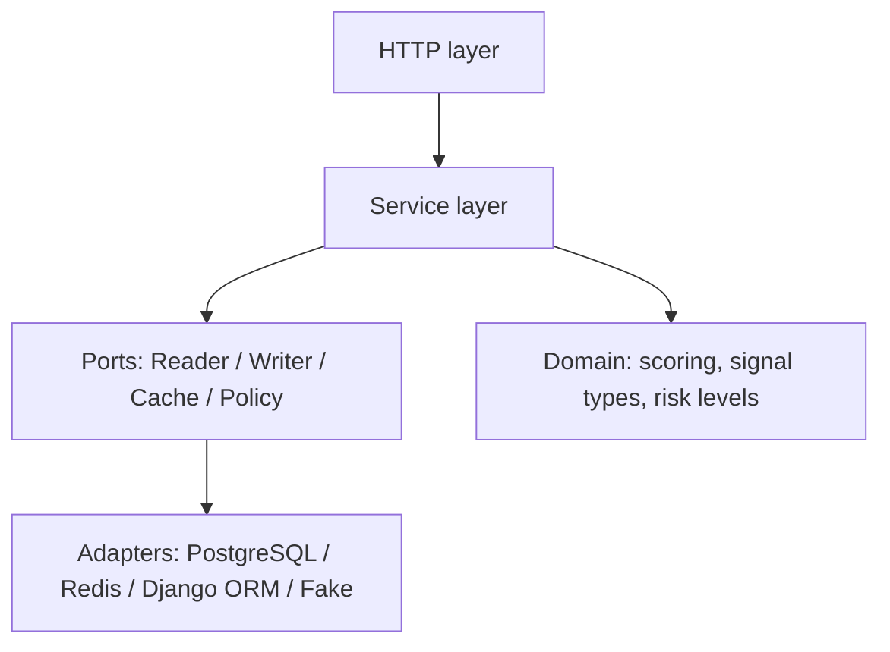
```mermaid
flowchart TD
    API["HTTP layer"] --> Service["Service layer"]
    Service --> Ports["Ports: Reader / Writer / Cache / Policy"]
    Ports --> Adapters["Adapters: PostgreSQL / Redis / Django ORM / Fake"]
    Service --> Domain["Domain: scoring, signal types, risk levels"]
```

Why it fits:

- Framework code is outside the core workflow.
- Domain and services can be tested without a running database or Redis.
- FastAPI and Django can expose the same product behavior through different web frameworks.

## 16. Cache-Aside

Risk summaries use cache-aside behavior.

Flow:

1. Read risk summary.
2. Check cache.
3. On miss, query database and compute score.
4. Store summary with TTL.
5. On new signal, evict the service summary key.

Why it fits:

- Risk summaries are read often during incidents.
- Writes must invalidate stale summaries.
- Redis failure can degrade latency without losing source-of-truth data.

## 17. Publish-Subscribe

Observer is the in-process form. Pub/sub is the distributed extension.

Current shape:

- Ingest service publishes to in-memory observers.

Natural product extension:

- Publish `SignalIngested` to Kafka, SNS/SQS, Redis Streams, or NATS.
- Independent subscribers handle Slack, PagerDuty, audit logs, and analytics.

Why it fits:

- Ingestion throughput should not be tied to slow side effects.
- External consumers may need events without calling the API.

## Python 3 LLD Class Diagrams

This section focuses on Python 3 low-level design. The diagrams use the FastAPI implementation because it makes the object relationships explicit with `Protocol`, `ABC`, constructor injection, and adapter classes.

## Python 3 LLD Overview

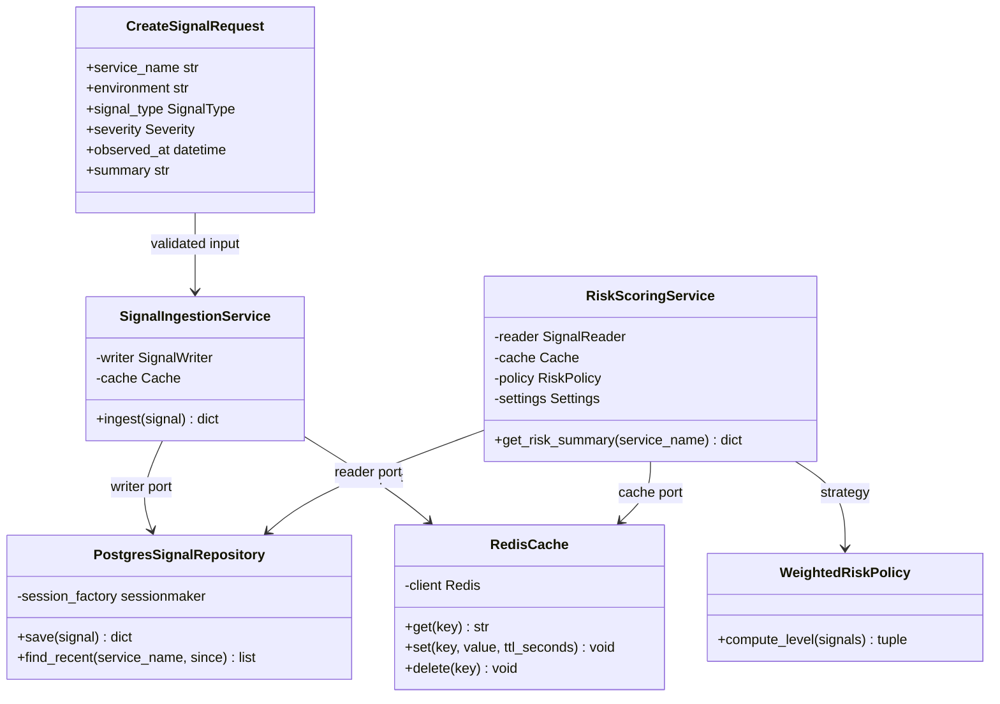
```mermaid
classDiagram
    class CreateSignalRequest {
        +service_name str
        +environment str
        +signal_type SignalType
        +severity Severity
        +observed_at datetime
        +summary str
    }
    class SignalIngestionService {
        -writer SignalWriter
        -cache Cache
        +ingest(signal) dict
    }
    class RiskScoringService {
        -reader SignalReader
        -cache Cache
        -policy RiskPolicy
        -settings Settings
        +get_risk_summary(service_name) dict
    }
    class PostgresSignalRepository {
        -session_factory sessionmaker
        +save(signal) dict
        +find_recent(service_name, since) list
    }
    class RedisCache {
        -client Redis
        +get(key) str
        +set(key, value, ttl_seconds) void
        +delete(key) void
    }
    class WeightedRiskPolicy {
        +compute_level(signals) tuple
    }

    CreateSignalRequest --> SignalIngestionService : validated input
    SignalIngestionService --> PostgresSignalRepository : writer port
    SignalIngestionService --> RedisCache : cache port
    RiskScoringService --> PostgresSignalRepository : reader port
    RiskScoringService --> RedisCache : cache port
    RiskScoringService --> WeightedRiskPolicy : strategy
```

LLD talking points:

- Request schemas are separate from persistence classes.
- Services are constructor-injected with ports/adapters.
- The repository implements both read and write contracts.
- Risk scoring is delegated to a policy object, so the service remains stable when scoring changes.

## Python 3 Protocols As Interfaces

Python does not need Java-style interfaces. `Protocol` gives structural polymorphism: any object with the required methods satisfies the contract.

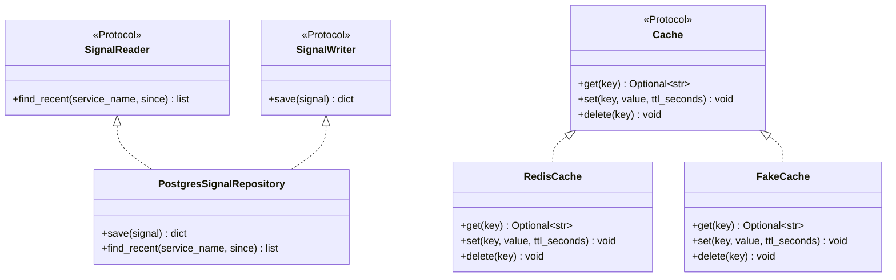
```mermaid
classDiagram
    class SignalReader {
        <<Protocol>>
        +find_recent(service_name, since) list
    }
    class SignalWriter {
        <<Protocol>>
        +save(signal) dict
    }
    class Cache {
        <<Protocol>>
        +get(key) Optional~str~
        +set(key, value, ttl_seconds) void
        +delete(key) void
    }
    class PostgresSignalRepository {
        +save(signal) dict
        +find_recent(service_name, since) list
    }
    class RedisCache {
        +get(key) Optional~str~
        +set(key, value, ttl_seconds) void
        +delete(key) void
    }
    class FakeCache {
        +get(key) Optional~str~
        +set(key, value, ttl_seconds) void
        +delete(key) void
    }

    SignalReader <|.. PostgresSignalRepository
    SignalWriter <|.. PostgresSignalRepository
    Cache <|.. RedisCache
    Cache <|.. FakeCache
```

How to explain it in an LLD interview:

1. `SignalReader`, `SignalWriter`, and `Cache` are the contracts.
2. Services depend on those contracts, not on SQLAlchemy or Redis.
3. `PostgresSignalRepository` satisfies both reader and writer contracts.
4. Tests can pass `FakeCache` because it has the same public methods.
5. This is polymorphism through structure rather than inheritance.

## Python 3 Strategy Class Diagram

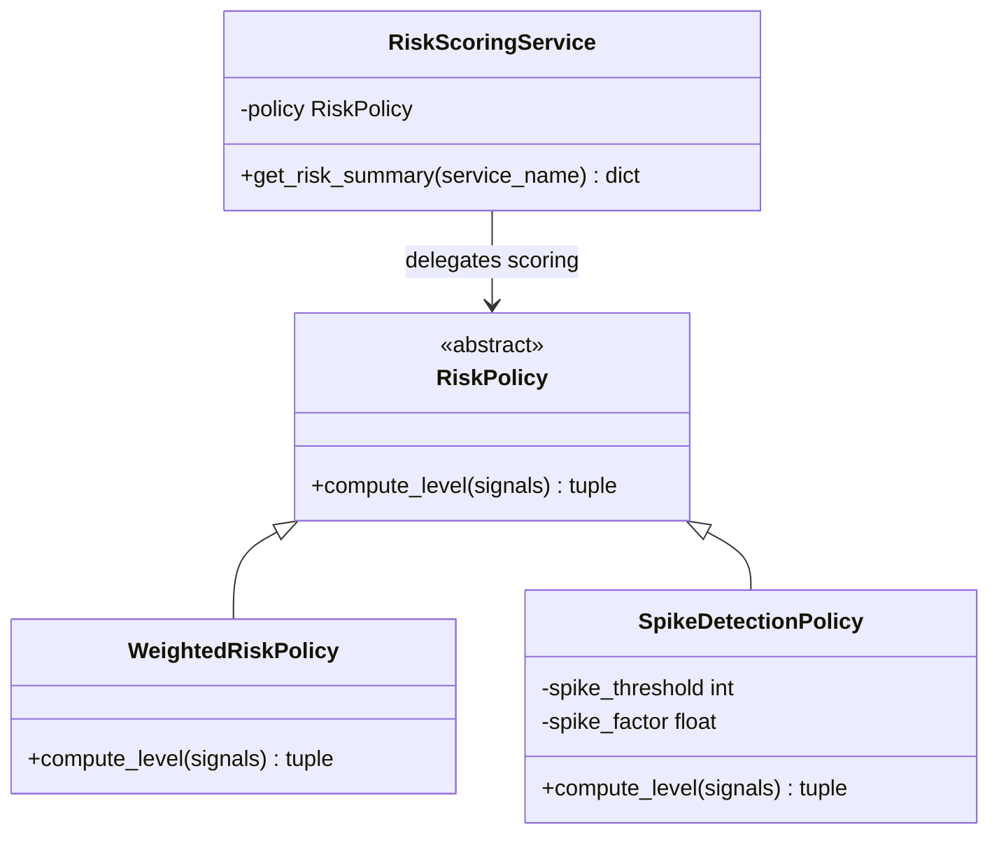
```mermaid
classDiagram
    class RiskPolicy {
        <<abstract>>
        +compute_level(signals) tuple
    }
    class WeightedRiskPolicy {
        +compute_level(signals) tuple
    }
    class SpikeDetectionPolicy {
        -spike_threshold int
        -spike_factor float
        +compute_level(signals) tuple
    }
    class RiskScoringService {
        -policy RiskPolicy
        +get_risk_summary(service_name) dict
    }

    RiskPolicy <|-- WeightedRiskPolicy
    RiskPolicy <|-- SpikeDetectionPolicy
    RiskScoringService --> RiskPolicy : delegates scoring
```

LLD answer:

- `RiskPolicy` is the abstract strategy.
- `WeightedRiskPolicy` is the default strategy.
- `SpikeDetectionPolicy` is an alternate strategy for bursty incidents.
- `RiskScoringService` depends on `RiskPolicy`, so it is closed for modification when new scoring policies are added.

## Python 3 Repository And ORM Class Diagram

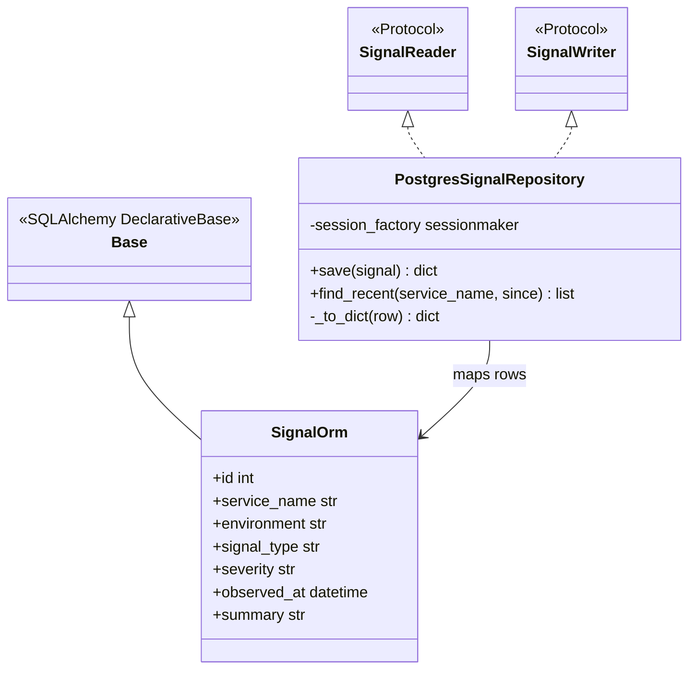
```mermaid
classDiagram
    class Base {
        <<SQLAlchemy DeclarativeBase>>
    }
    class SignalOrm {
        +id int
        +service_name str
        +environment str
        +signal_type str
        +severity str
        +observed_at datetime
        +summary str
    }
    class PostgresSignalRepository {
        -session_factory sessionmaker
        +save(signal) dict
        +find_recent(service_name, since) list
        -_to_dict(row) dict
    }
    class SignalReader {
        <<Protocol>>
    }
    class SignalWriter {
        <<Protocol>>
    }

    Base <|-- SignalOrm
    SignalReader <|.. PostgresSignalRepository
    SignalWriter <|.. PostgresSignalRepository
    PostgresSignalRepository --> SignalOrm : maps rows
```

LLD answer:

- `SignalOrm` is persistence shape.
- API schemas are not reused as database rows.
- Repository owns mapping between dictionaries and ORM rows.
- That keeps SQLAlchemy out of business services.

## Python 3 Builder Class Diagram

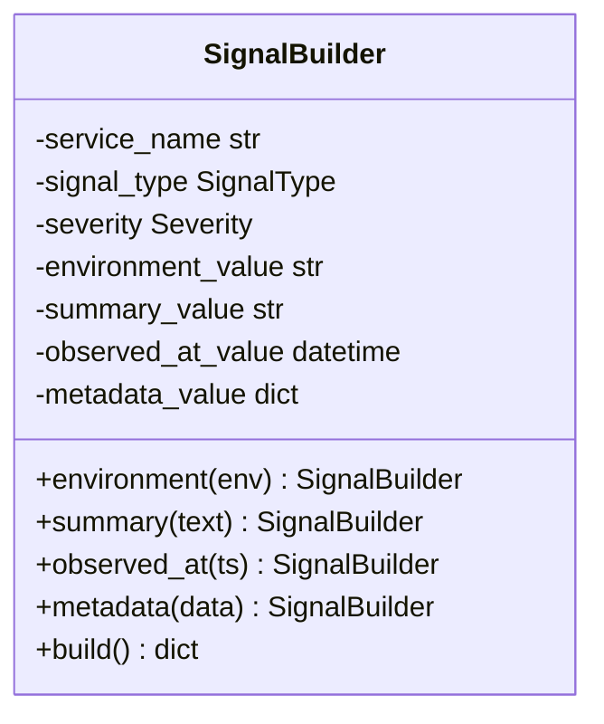
```mermaid
classDiagram
    class SignalBuilder {
        -service_name str
        -signal_type SignalType
        -severity Severity
        -environment_value str
        -summary_value str
        -observed_at_value datetime
        -metadata_value dict
        +environment(env) SignalBuilder
        +summary(text) SignalBuilder
        +observed_at(ts) SignalBuilder
        +metadata(data) SignalBuilder
        +build() dict
    }
```

LLD answer:

- Builder is useful when construction has required fields plus optional fields.
- It avoids long constructors with many optional parameters.
- Fluent methods make test fixtures and remediation payloads easy to read.

## Python 3 Observer Class Diagram

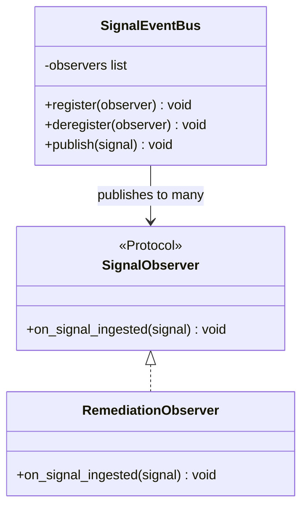
```mermaid
classDiagram
    class SignalObserver {
        <<Protocol>>
        +on_signal_ingested(signal) void
    }
    class SignalEventBus {
        -observers list
        +register(observer) void
        +deregister(observer) void
        +publish(signal) void
    }
    class RemediationObserver {
        +on_signal_ingested(signal) void
    }

    SignalObserver <|.. RemediationObserver
    SignalEventBus --> SignalObserver : publishes to many
```

LLD answer:

- The event bus is the subject.
- Observers subscribe to signal ingestion events.
- Ingestion code does not know whether the observer opens a ticket, sends Slack, or triggers PagerDuty.
- For production, make observer execution async and isolate failures.

## Python 3 Singleton Class Diagram

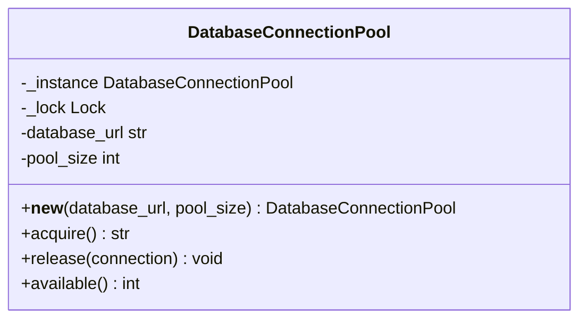
```mermaid
classDiagram
    class DatabaseConnectionPool {
        -_instance DatabaseConnectionPool
        -_lock Lock
        -database_url str
        -pool_size int
        +__new__(database_url, pool_size) DatabaseConnectionPool
        +acquire() str
        +release(connection) void
        +available() int
    }
```

LLD answer:

- `__new__` controls object creation before `__init__`.
- The class-level lock prevents duplicate creation under concurrent access.
- For production Python web apps, a framework/container-managed pool is usually better, but this class demonstrates the raw pattern clearly.

## Python 3 Request Flow Sequence Diagram

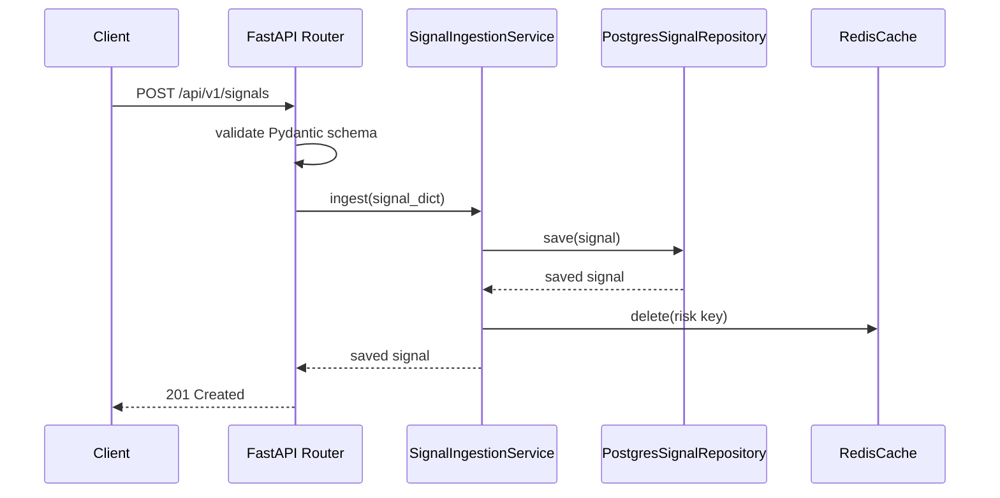
```mermaid
sequenceDiagram
    participant Client
    participant Router as FastAPI Router
    participant Ingest as SignalIngestionService
    participant Repo as PostgresSignalRepository
    participant Cache as RedisCache

    Client->>Router: POST /api/v1/signals
    Router->>Router: validate Pydantic schema
    Router->>Ingest: ingest(signal_dict)
    Ingest->>Repo: save(signal)
    Repo-->>Ingest: saved signal
    Ingest->>Cache: delete(risk key)
    Ingest-->>Router: saved signal
    Router-->>Client: 201 Created
```

## Python 3 Risk Summary Sequence Diagram

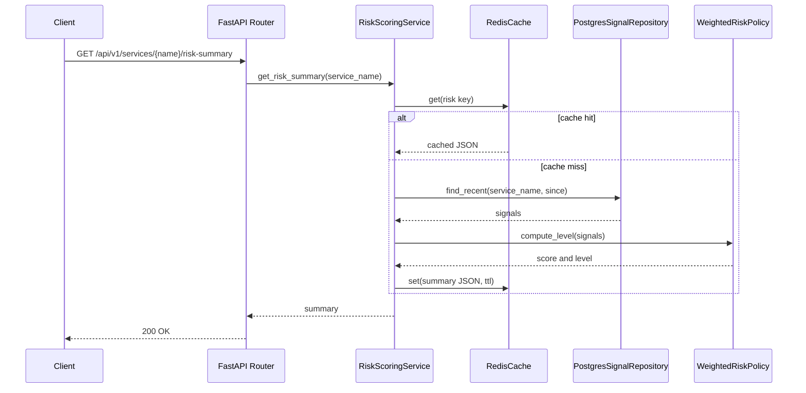
```mermaid
sequenceDiagram
    participant Client
    participant Router as FastAPI Router
    participant Risk as RiskScoringService
    participant Cache as RedisCache
    participant Repo as PostgresSignalRepository
    participant Policy as WeightedRiskPolicy

    Client->>Router: GET /api/v1/services/{name}/risk-summary
    Router->>Risk: get_risk_summary(service_name)
    Risk->>Cache: get(risk key)
    alt cache hit
        Cache-->>Risk: cached JSON
    else cache miss
        Risk->>Repo: find_recent(service_name, since)
        Repo-->>Risk: signals
        Risk->>Policy: compute_level(signals)
        Policy-->>Risk: score and level
        Risk->>Cache: set(summary JSON, ttl)
    end
    Risk-->>Router: summary
    Router-->>Client: 200 OK
```

## LLD Interview Walkthrough

Use this framing when explaining the Python 3 design in a low-level design interview.

### 1. Clarify The Requirements

- Ingest operational signals from CI/CD, deployment tools, security scanners, and monitors.
- Store signals durably.
- Compute a per-service risk summary.
- Cache risk summaries for read-heavy dashboards.
- Keep scoring algorithms replaceable.
- Keep infrastructure replaceable for tests and deployments.

### 2. Identify The Core Objects

| Object | Responsibility |
|---|---|
| `CreateSignalRequest` | validates incoming API payload |
| `SignalIngestionService` | writes signals and evicts cached summary |
| `RiskScoringService` | loads recent signals and computes summary |
| `RiskPolicy` | defines scoring algorithm contract |
| `PostgresSignalRepository` | stores and reads signals |
| `Cache` | abstracts Redis/fake cache |
| `SignalEventBus` | publishes ingestion events |

### 3. Explain The Class Relationships

- API layer owns HTTP concerns only.
- Services own business workflow.
- Repositories own persistence.
- Policies own scoring.
- Cache owns temporary read optimization.
- Event bus owns fan-out to side effects.

### 4. Name The Patterns

- Strategy for scoring.
- Adapter and Repository for infrastructure.
- Observer for signal side effects.
- Builder for complex object construction.
- Singleton for the demonstration connection pool.
- DTO and Value Object for API/domain shape.
- Cache-aside for read path optimization.
- Dependency Injection for wiring.

### 5. Discuss Scale And Failure Modes

| Concern | Design answer |
|---|---|
| Hot dashboards | Redis cache-aside summaries |
| Stale summaries | evict cache on signal write |
| Duplicate webhook retries | add idempotency key |
| Slow remediation side effects | move observers to async command queue |
| Lost external event | add transactional outbox |
| Spiky ingestion | queue signals through Kafka/SQS |
| Noisy client | add API-key rate limiting |

## Natural Extension Patterns

These are not all fully implemented today, but they are credible next steps for the product.

## 18. Command

Use Command for remediation actions.

Examples:

- `TriggerPagerDutyIncidentCommand`
- `OpenJiraTicketCommand`
- `PauseArgoRolloutCommand`
- `SendSlackRiskDigestCommand`

Why it would fit:

- Actions can be queued, retried, logged, audited, and replayed.
- Each action has a uniform `execute()` shape.

## 19. Chain Of Responsibility

Use Chain of Responsibility for signal enrichment or validation.

Possible chain:

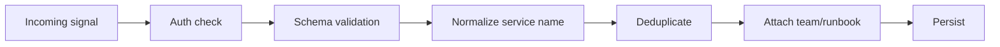
```mermaid
flowchart LR
    Incoming["Incoming signal"] --> Auth["Auth check"]
    Auth --> Schema["Schema validation"]
    Schema --> Normalize["Normalize service name"]
    Normalize --> Dedupe["Deduplicate"]
    Dedupe --> Enrich["Attach team/runbook"]
    Enrich --> Persist["Persist"]
```

Why it would fit:

- Each handler owns one step.
- Teams can insert new processing steps without rewriting ingestion.

## 20. State

Use State for incident or release-gate lifecycle.

Example lifecycle:

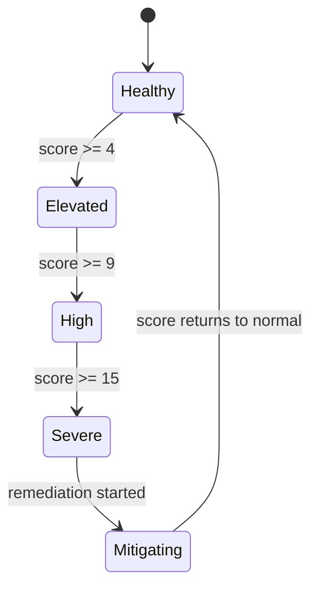
```mermaid
stateDiagram-v2
    [*] --> Healthy
    Healthy --> Elevated: score >= 4
    Elevated --> High: score >= 9
    High --> Severe: score >= 15
    Severe --> Mitigating: remediation started
    Mitigating --> Healthy: score returns to normal
```

Why it would fit:

- Each state can decide valid transitions.
- Alerting rules can differ by state.
- Recovery behavior can be explicit.

## 21. Composite

Use Composite to roll up risk from service to team to organization.

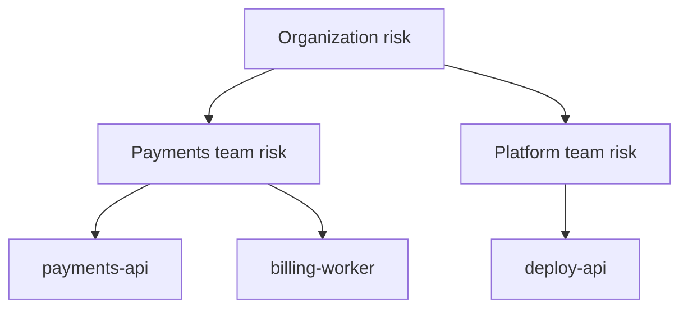
```mermaid
flowchart TD
    Org["Organization risk"] --> TeamA["Payments team risk"]
    Org --> TeamB["Platform team risk"]
    TeamA --> Service1["payments-api"]
    TeamA --> Service2["billing-worker"]
    TeamB --> Service3["deploy-api"]
```

Why it would fit:

- A team risk score can be calculated from child service scores.
- The same interface can expose risk for a service, team, domain, or org.

## 22. Specification

Use Specification for reusable release policies.

Examples:

- `HasNoSevereSignals`
- `DeploymentFailureCountBelow(2)`
- `SecurityAlertsResolved`
- `DatabaseSaturationBelowThreshold`

Why it would fit:

- Complex business rules become composable.
- Release gates can explain which rule failed.

## 23. Unit Of Work

Use Unit of Work if ingestion writes multiple records transactionally.

Example:

- Write signal.
- Write audit row.
- Write derived risk snapshot.
- Enqueue outbox event.

Why it would fit:

- Either all writes commit or none do.
- It pairs well with the transactional outbox pattern.

## 24. Transactional Outbox

Use Transactional Outbox when external events must not be lost.

Flow:

1. Insert signal and outbox event in the same database transaction.
2. Background worker reads unsent outbox events.
3. Worker publishes to Kafka/SNS/SQS.
4. Worker marks event as sent.

Why it would fit:

- Prevents the classic problem: database write succeeds, message publish fails.
- Makes event delivery auditable.

## 25. Circuit Breaker

Use Circuit Breaker around external integrations.

Examples:

- PagerDuty API.
- Slack webhook.
- Jira API.
- Client deployment API.

Why it would fit:

- Avoids exhausting threads when an external dependency is down.
- Allows fallback behavior like queueing commands for retry.

## 26. Bulkhead

Use Bulkhead to isolate resource pools.

Examples:

- Separate thread pool for notifications.
- Separate queue for remediation commands.
- Separate DB pool for analytics reads.

Why it would fit:

- Slow notification delivery should not block signal ingestion.
- Risk reads should not starve writes.

## 27. Retry With Backoff

Use Retry with exponential backoff for transient failures.

Examples:

- Temporary Redis timeout.
- Short-lived webhook failure.
- Cloud API throttling.

Why it would fit:

- Many operational failures are transient.
- Backoff protects downstream systems from retry storms.

## 28. Idempotency Key

Use Idempotency Key for duplicate-safe ingestion.

Example:

- CI sends `X-Idempotency-Key: build-1234-deploy-prod`.
- API stores the key with the signal.
- Retried request returns the original result instead of creating duplicates.

Why it would fit:

- CI and webhook systems commonly retry.
- Risk scores should not double-count duplicate events.

## 29. Rate Limiter

Use Rate Limiter to protect the public API.

Examples:

- Limit signals per client per minute.
- Limit risk summary reads per dashboard.
- Separate client quotas by API key.

Why it would fit:

- Prevents noisy clients from impacting other clients.
- Makes the product safer for multi-tenant use.

## 30. CQRS

Use CQRS if write and read models diverge.

Current:

- Signal writes and risk reads share the same PostgreSQL signal table.

Possible extension:

- Write raw signals to one model.
- Maintain precomputed risk summaries in another model.

Why it would fit:

- High-volume ingestion and fast dashboards have different access patterns.
- Read models can be optimized for dashboards without complicating writes.

## Pattern Interaction Map

```mermaid
flowchart TD
    Client["Client / CI / monitor"] --> API["DTO + validation"]
    API --> Facade1["SignalIngestionService facade"]
    Facade1 --> Repo["Repository / Adapter"]
    Facade1 --> Cache["Cache-aside eviction"]
    Facade1 --> Observer["Observer publisher"]
    Observer --> Builder["Alert builder"]
    API --> Facade2["RiskScoringService facade"]
    Facade2 --> Strategy["Strategy: weighted or spike scoring"]
    Facade2 --> CacheRead["Cache-aside read"]
    Facade2 --> Summary["Value object / DTO response"]
```

## How To Talk About The Design

1. Signal Harbor is primarily composition-first: services receive repositories, cache clients, policies, settings, and event publishers.
2. Strategy keeps risk scoring replaceable.
3. Observer keeps ingestion side effects replaceable.
4. Builder makes alert/signal object construction readable and safer.
5. Adapter and Repository keep PostgreSQL, Redis, Django ORM, SQLAlchemy, and tests behind stable contracts.
6. DTOs and value objects protect the API from leaking persistence models.
7. Cache-aside makes risk reads fast while keeping PostgreSQL as the source of truth.
8. Future product growth naturally points to Command, State, Specification, CQRS, Outbox, Circuit Breaker, Bulkhead, Rate Limiter, and Idempotency Key.
